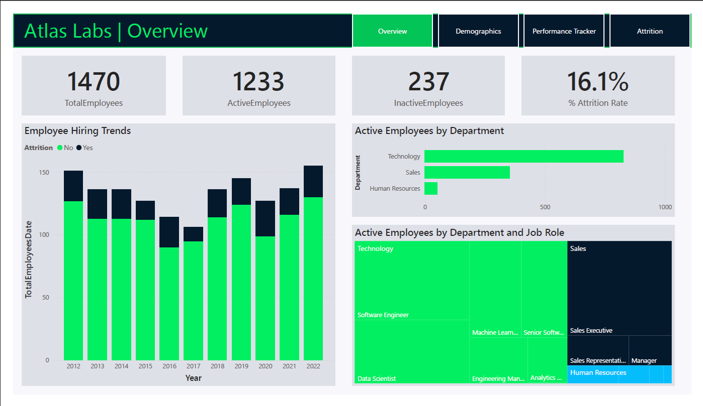
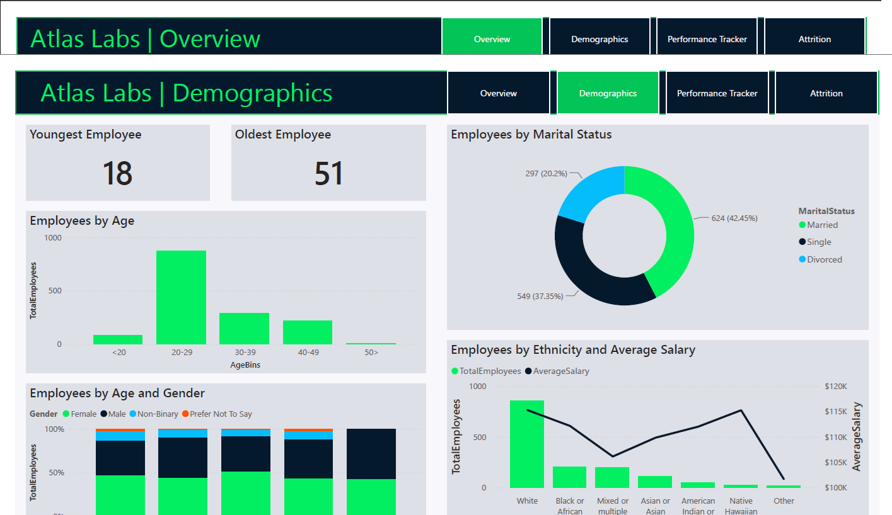
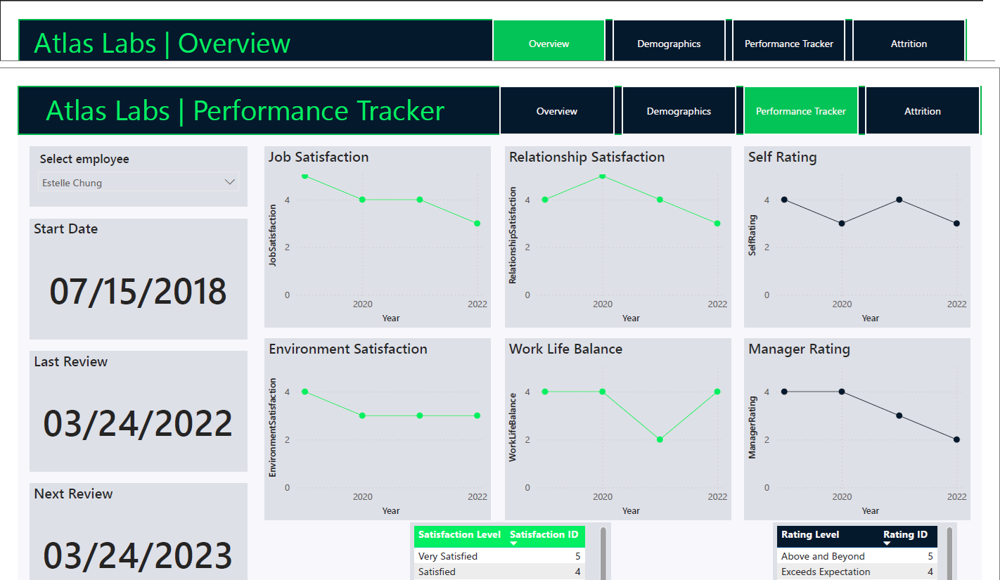
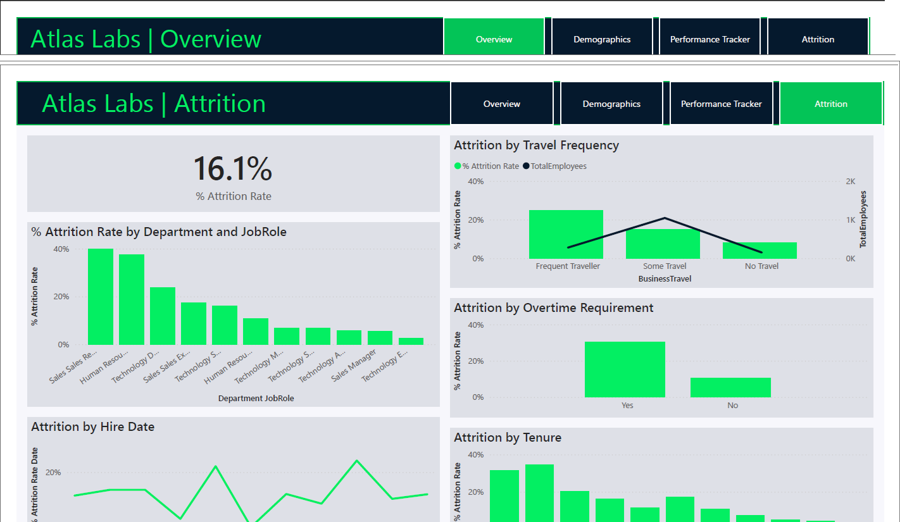

# 📊 Atlas Labs HR Analytics Dashboard

Interactive **Power BI** dashboard developed to analyze workforce demographics, employee performance, and attrition across Atlas Labs.

This project combines executive KPIs, employee demographics, performance tracking, and attrition analysis into an interactive business intelligence solution that supports data-driven HR decision-making and workforce planning.

---

# 🎯 Project Objective

Atlas Labs aims to improve workforce planning by understanding employee demographics, monitoring workforce performance, and identifying the primary factors contributing to employee attrition.

The objective of this project was to:

- Monitor company-wide HR KPIs
- Analyze workforce demographics
- Track employee performance metrics
- Identify drivers of employee attrition
- Deliver actionable insights through interactive dashboards

---

# 💼 Business Problem

Employee turnover can significantly increase recruitment costs, reduce productivity, and impact organizational performance.

HR leaders require an interactive reporting solution that provides visibility into workforce composition, employee satisfaction, and attrition trends to support strategic decision-making and employee retention initiatives.

---

# 🛠 Tools Used

- Power BI
- Power Query
- DAX
- Data Modeling
- Interactive Dashboards
- Data Visualization

---

# 📊 Dashboard Pages

## Executive Overview



Provides a high-level summary of the organization's workforce, including:

- Total Employees
- Active Employees
- Inactive Employees
- Overall Attrition Rate
- Department Distribution
- Annual Hiring Trends

---

## Workforce Demographics



Analyzes employee demographics across multiple dimensions, including:

- Age Distribution
- Gender Breakdown
- Marital Status
- Ethnicity
- Salary Distribution

---

## Performance Tracker



Interactive employee performance dashboard displaying:

- Job Satisfaction
- Environment Satisfaction
- Relationship Satisfaction
- Work-Life Balance
- Self Performance Rating
- Manager Rating
- Performance Review Timeline

---

## Attrition Analysis



Examines the primary drivers of employee turnover through:

- Attrition by Department
- Attrition by Job Role
- Overtime Analysis
- Business Travel Analysis
- Employee Tenure Analysis

---

# 💡 Key Insights

- Technology represented the largest department, followed by Sales and Human Resources.
- The workforce was primarily concentrated within the 20–29 age group while maintaining a balanced gender distribution.
- Employees working overtime experienced nearly three times the attrition rate of employees who did not work overtime.
- Sales Representatives and Human Resources roles exhibited the highest employee turnover.
- Employee attrition was highest during the first year of employment and declined as tenure increased.

---

# 📈 Business Recommendations

- Strengthen onboarding and employee engagement programs during the first year of employment.
- Reduce excessive overtime through improved workforce planning and resource allocation.
- Develop targeted retention initiatives for Sales and Human Resources teams.
- Continuously monitor employee satisfaction metrics to identify early retention risks.
- Utilize demographic and workforce insights to support strategic hiring and succession planning.

---

# 🚀 Skills Demonstrated

- Power BI Dashboard Development
- Power Query (ETL)
- DAX Calculations
- Data Modeling
- KPI Development
- HR Analytics
- Workforce Analytics
- Interactive Reporting
- Business Intelligence
- Data Storytelling

---

# 📁 Repository Structure

```
Atlas-Labs-HR-Analytics-Dashboard
│
├── README.md
├── HR Analytics Dashboard.pbix
├── overview.png
├── demographics.png
├── performance-tracker.png
└── attrition.png
```

---

# 📌 Dataset

This dashboard was developed using the **Atlas Labs HR Analytics** case study dataset provided through a DataCamp learning exercise.

The dataset is not included in this repository due to licensing and redistribution restrictions.

---

# 👨‍💻 Author

**Juan Miguel T. Naval**

📧 navalmiguel98@gmail.com

🔗 LinkedIn: https://linkedin.com/in/miguel-naval

💻 GitHub: https://github.com/MiguelNaval
