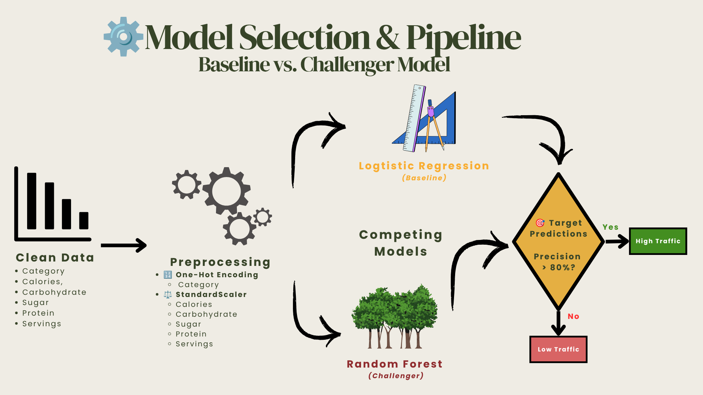
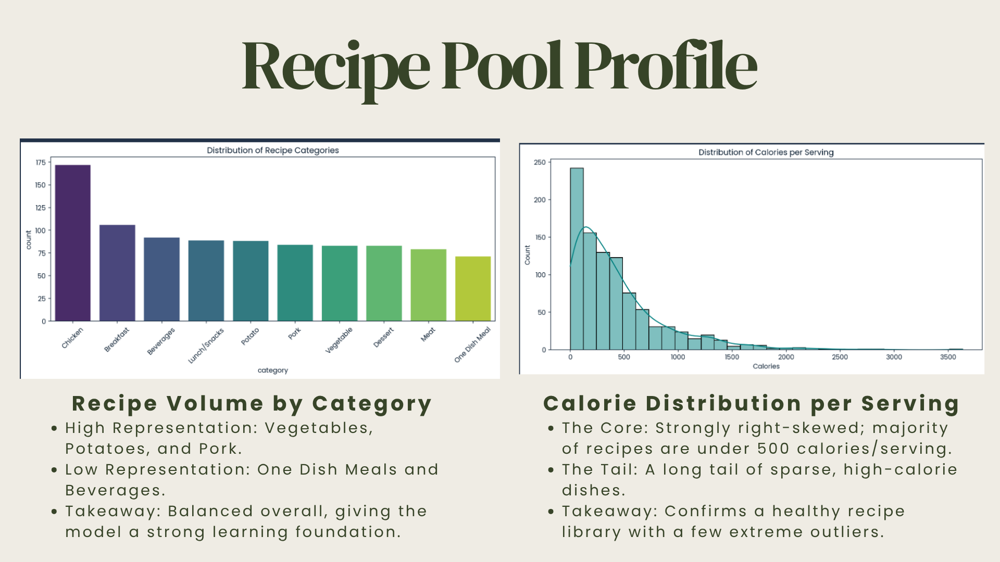
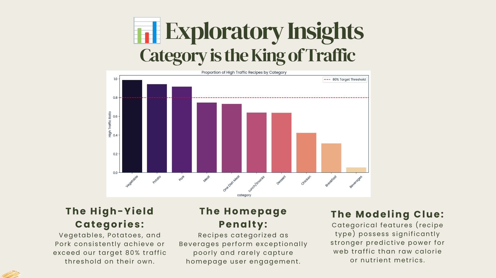
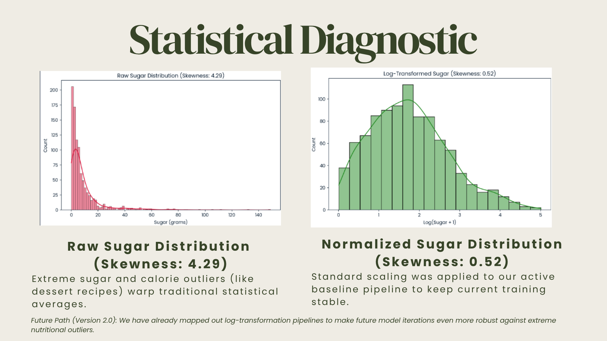
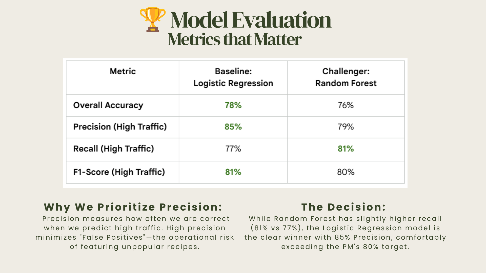

# 🍽️ Tasty Bytes Recipe Traffic Prediction

Machine learning project that predicts whether a recipe will achieve **high website traffic** using nutritional information and recipe characteristics.

This project was completed as part of the **DataCamp Data Scientist Certification Practical Exam**, following an end-to-end data science workflow from data cleaning to model evaluation.

---

# Project Objective

A recipe website wants to identify recipes likely to generate high traffic so that featured content can be selected more effectively.

The objective was to build a classification model capable of predicting whether a recipe would achieve at least **80% precision** while extracting actionable business insights.

---

# Business Problem

Selecting recipes manually is inconsistent and time-consuming.

Using historical recipe data, this project develops a predictive model that helps content managers prioritize recipes with the highest probability of generating website traffic.

---

# Dataset

The dataset contains recipe information including:

- Recipe category
- Calories
- Carbohydrates
- Sugar
- Protein
- Number of servings
- Website traffic label

---

# Tools Used

- Python
- Pandas
- NumPy
- Matplotlib
- Seaborn
- Scikit-learn

---

# Workflow

1. Data Cleaning
2. Exploratory Data Analysis
3. Feature Engineering
4. Model Development
5. Model Evaluation
6. Business Recommendations

---

# Dashboard & Analysis

## Model Pipeline



---

## Dataset Overview



---

## Exploratory Insights



---

## Feature Engineering



---

## Model Comparison



---

# Key Insights

- Vegetables, potatoes, and pork recipes consistently generated the highest website traffic.
- Recipe category was a stronger predictor than nutritional variables.
- Log transformation reduced feature skewness and improved model stability.
- Logistic Regression served as the baseline model while Random Forest was evaluated as a challenger model.
- The selected model satisfied the business precision requirement for identifying high-traffic recipes.

---

# Repository Structure

```
Tasty-Bytes-Recipe-Traffic-Prediction
│
├── README.md
├── recipe-traffic-prediction.ipynb
├── requirements.txt
├── hero.png
├── dataset-overview.png
├── traffic-by-category.png
├── feature-engineering.png
└── model-comparison.png
```

---

# Skills Demonstrated

- Data Cleaning
- Exploratory Data Analysis
- Feature Engineering
- Predictive Modeling
- Classification
- Model Evaluation
- Business Analytics
- Data Visualization

---

# Author

**Juan Miguel T. Naval**

- LinkedIn: https://linkedin.com/in/miguel-naval
- GitHub: https://github.com/MiguelNaval
