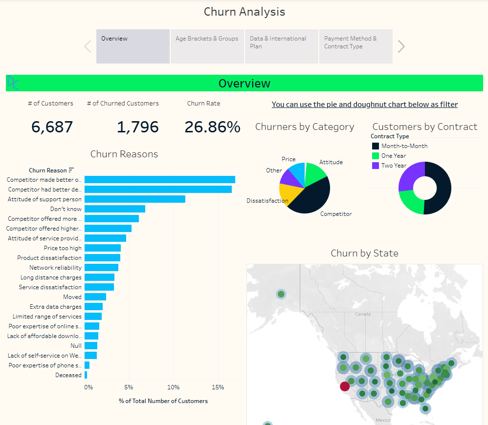
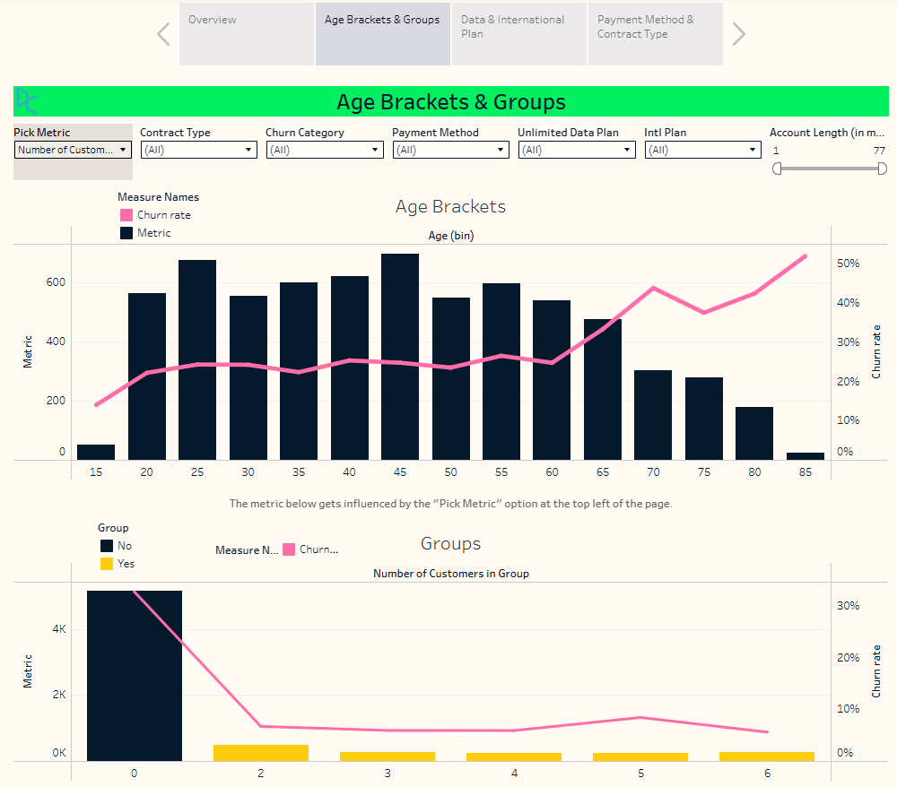
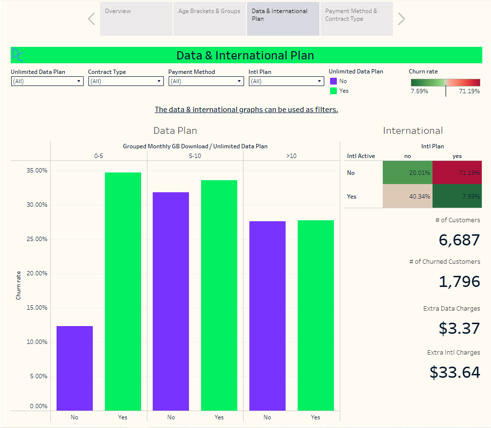
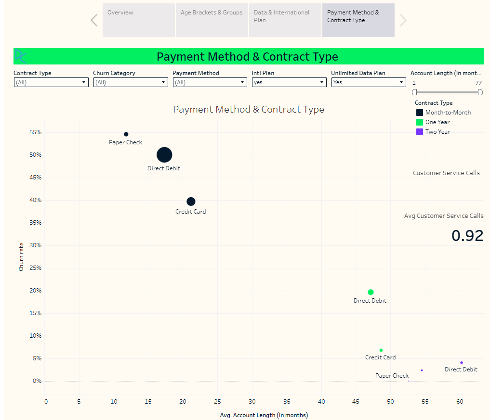

## 🌐 Live Dashboard

View the interactive dashboard on Tableau Public:

**[https://public.tableau.com/...](https://public.tableau.com/views/TelecomCustomerChurnDashboard_17858946718220/ChurnAnalysis?:language=en-US&:sid=&:redirect=auth&:display_count=n&:origin=viz_share_link)**


# 📊 Telecom Customer Retention Dashboard

Interactive **Tableau** dashboard developed to analyze customer churn across demographics, service plans, payment methods, contract types, and geographic regions.

The dashboard enables stakeholders to identify customer segments with the highest churn risk, monitor key performance indicators, and support data-driven customer retention strategies through interactive visualizations.

---

# 🎯 Project Objective

Customer churn directly impacts revenue growth and customer lifetime value. This project analyzes customer demographics, subscription plans, and service usage to identify the primary drivers of churn and provide actionable recommendations for improving customer retention.

The objective of this project was to:

- Monitor customer churn KPIs
- Identify high-risk customer segments
- Analyze churn across demographics and service plans
- Explore geographic churn patterns
- Support customer retention through interactive dashboards

---

# 💼 Business Problem

Retaining existing customers is significantly more cost-effective than acquiring new ones. Without understanding the factors contributing to customer churn, organizations struggle to prioritize retention initiatives effectively.

This dashboard provides business stakeholders with an interactive reporting solution to monitor churn trends, explore customer segments, and identify opportunities to improve customer retention.

---

# 🛠 Tools Used

- Tableau
- Interactive Dashboards
- KPI Design
- Geographic Visualization
- Data Storytelling
- Customer Analytics

---

# 📊 Dashboard Pages

## Executive Overview



Provides a high-level summary of customer churn performance, including:

- Executive KPI Cards
- Customer Overview
- Churn Summary
- Geographic Distribution
- Interactive Dashboard Filters

---

## Customer Demographics



Analyzes customer churn across demographic groups, including:

- Age Brackets
- Customer Segments
- Geographic Regions
- Churn Distribution
- Interactive Drill-down Analysis

---

## Service Plans Analysis



Examines customer churn by subscription and service characteristics, including:

- Internet Plans
- Phone Services
- International Plans
- Service Adoption
- Customer Segmentation

---

## Payment & Contract Analysis



Investigates customer retention through:

- Payment Methods
- Contract Types
- Churn Rate Comparison
- Customer Risk Segmentation
- Interactive Cross Filtering

---

# 💡 Key Insights

- Customers on month-to-month contracts exhibited substantially higher churn than customers with longer-term contracts.
- Competitor offerings represented the primary reason for customer churn.
- Older customer groups demonstrated higher churn rates than younger customers.
- Contract type and payment method were among the strongest indicators of customer retention.
- Combining demographic and service usage data enabled more targeted customer segmentation and retention strategies.

---

# 📈 Business Recommendations

- Encourage customers to transition from month-to-month contracts to long-term subscription plans.
- Develop targeted retention campaigns for high-risk customer segments.
- Improve customer engagement for older customer demographics.
- Monitor competitor-related churn through proactive customer outreach.
- Track churn KPIs using interactive dashboards to support continuous retention initiatives.

---

# 🚀 Skills Demonstrated

- Tableau Dashboard Development
- Interactive Visualizations
- Customer Analytics
- Customer Segmentation
- Geographic Mapping
- KPI Dashboard Design
- Data Storytelling
- Business Intelligence
- Churn Analysis
- Executive Reporting

---

# 📁 Repository Structure

```
Telecom-Customer-Retention-Dashboard
│
├── README.md
├── Telecom Customer Churn Dashboard.twbx
├── overview.png
├── age-groups.png
├── plans.png
└── payment-contract.png
```

---

# 📌 Dataset

This dashboard was developed using a telecom customer churn case study completed as part of a DataCamp Tableau learning exercise.

The original dataset is not included in this repository due to licensing and redistribution restrictions.

---

# 👨‍💻 Author

**Juan Miguel T. Naval**

📧 navalmiguel98@gmail.com

🔗 LinkedIn: https://linkedin.com/in/miguel-naval

💻 GitHub: https://github.com/MiguelNaval
